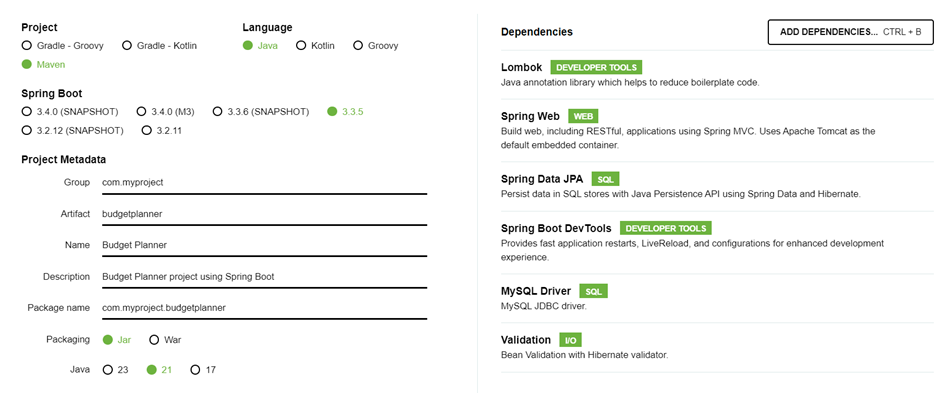

# budget-planner project
Budget Planner Project using Spring Boot, final project for CBF bootcamp


## Description

Build a RESTful API service that allows users to `create`, `read`, `update`, and `delete` budgets using Java and Spring Boot.
This is a simple web application to track daily incomes and expenses, where user can sign up, sign in, add, remove or edit the income or expense details.
## Getting Started

### Clone Repository
1. Fork this repository in your GitHub account
2. Clone your fork locally or open in CodeSpaces.

```sh
git clone [REPO_URL]
cd [REPO_NAME]
```

> :bulb: **Note:** Replace [REPO_URL] with the link to your GitHub repository and [REPO_NAME] with the repository's name.

### Create Database
1. Login to MySQL:

```sh
mysql -u root -p
```
> :bulb: **Note:** If your root user doesn't have a password set, omit the `-p` flag.

2. Create a new database:

```sh
CREATE DATABASE IF NOT EXISTS budgetplanner;
exit;
```

### Initialise Project
1. Open start.spring.io and insert the dependecies in the image below.

2. Ensure that your local repository is the current working directory in the terminal, then extract the downloaded zip file. **IMPORTANT:** Do NOT unzip the archive in (macOS) Finder or (Windows) Explorer as the extracted files won't be correctly positioned.
   - macOS / Git Bash: `tar -xvf [download directory]/restapiexercise.zip --strip=1 -C .`, e.g. `tar -xvf ~/Downloads/restapiexercise.zip --strip=1 -C .`
   - Windows Command Prompt: `tar -xvf [download directory]\restapiexercise.zip --strip=1 -C %cd%`, e.g. `tar -xvf %USERPROFILE%\Downloads\restapiexercise.zip --strip=1 -C %cd%`
3. Open your repository in VS Code
4. Add the following values to src/main/resources/application.properties:

```properties
spring.datasource.driver-class-name=com.mysql.cj.jdbc.Driver
spring.jpa.hibernate.ddl-auto=update
spring.jpa.open-in-view=true
spring.config.import=optional:./local.properties
```
5. In order to prevent sensitive values from being committed to version control, add a new entry to the .gitignore file:

```
local.properties
```

6. Create a new file at src/main/resources/local.properties and paste in the following: 

```properties
spring.datasource.url=jdbc:mysql://localhost:3306/restapiexercise

# Replace "root" with your database user, if applicable
spring.datasource.username=root

# Specify your database user's password, if applicable. If your database user doesn't have a password set, delete the line below
spring.datasource.password=YOUR_MYSQL_PASSWORD
```

7. Replace the username and password values with your MySQL credentials. **IMPORTANT:** Ensure there are no spaces before or after the password.

### Run Application

To start the API, run the following command:

#### macOS / Git Bash

```sh
./mvnw spring-boot:run
```

#### Windows Command Prompt

```cmd
mvnw spring-boot:run
```

If successful, you should see output that ends similarly to the following:

```
2024-04-12T11:49:59.055-04:00  INFO 39975 --- [REST API Exercise] [           main] o.s.b.w.embedded.tomcat.TomcatWebServer  : Tomcat started on port 8080 (http) with context path ''
2024-04-12T11:49:59.059-04:00  INFO 39975 --- [REST API Exercise] [           main] c.c.r.RestApiExerciseApplication         : Started RestApiExerciseApplication in 1.493 seconds (process running for 1.638)
```

**IMPORTANT**: If everything is working correctly, the output will appear "stuck" and the command prompt won't return until you stop the application, which should now be running at http://localhost:8080/api/ious.


## Features

- sign up, sign in
- email verification, forgot password
- responsive web design
- pagination
- secured REST end points
- 
- CRUD operations


## Built With

- React.js 16
- 
- Spring Boot 3.3.5
- MySQL