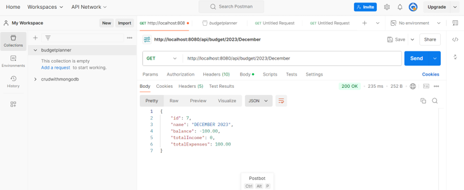

# Budget Planner API
Budget planner and expense tracker application; this application allows users to view their cashflow and manage their finances.




## Overview
This Budget Planner API is a RESTful web service built using Java and Spring Boot to help users manage their income and expenses efficiently. This API provides CRUD operations, allowing users to create, read, update, and delete records of their financial activities.

## Technologies
- Java
- Spring Boot
- Maven
- MySQL


## Getting Started

### Clone Repository
1. Fork this repository in your GitHub account
2. Clone your fork to your local machine. eg:
```
git clone git@github.com:username/budget-planner.git
```

## Setup and Configuration
1. **Prerequisites**:
   - Java 21
   - MySQL database server
   - Maven

2. **Configuration**:
   - Update `application.properties`:
   ```properties
   spring.datasource.url=jdbc:mysql://localhost:3307/budget_planner
   spring.datasource.username=your_username
   spring.datasource.password=your_password
   ```

3. **Run the Application**:
   - Use your IDE to run the Spring Boot application or use the command line:
   ```bash
   mvn spring-boot:run
   ```
- Once the server is up and running, you may access the REST APIs over the following base path and the end points below:  `http://localhost:8080/api`

4. **Database Dump**: 
- Database dump file location: src/main/java/com/myproject/budgetplanner/budgetplannerdumpfile.sql


## API Endpoints

### Income Endpoints
- `POST /api/income`: Create a new income record.
- `GET /api/income`: Retrieve all income records.
- `GET /api/income/{id}`: Retrieve a specific income record by ID.
- `PUT /api/income/{id}`: Update an existing income record.
- `DELETE /api/income/{id}`: Delete an income record by ID.

### Expense Endpoints
- `POST /api/expense`: Create a new expense record.
- `GET /api/expense`: Retrieve all expense records.
- `GET /api/expense/{id}`: Retrieve a specific expense record by ID.
- `PUT /api/expense/{id}`: Update an existing expense record.
- `DELETE /api/expense/{id}`: Delete an expense record by ID.

### Budget Endpoints
- `GET /api/budget/{year}/{month}`: Retrieve the budget for a specific year and month.


## Documentation
 Swagger is integrated into the project for detailed API documentation: (http://localhost:8080/swagger-ui/index.html#)
